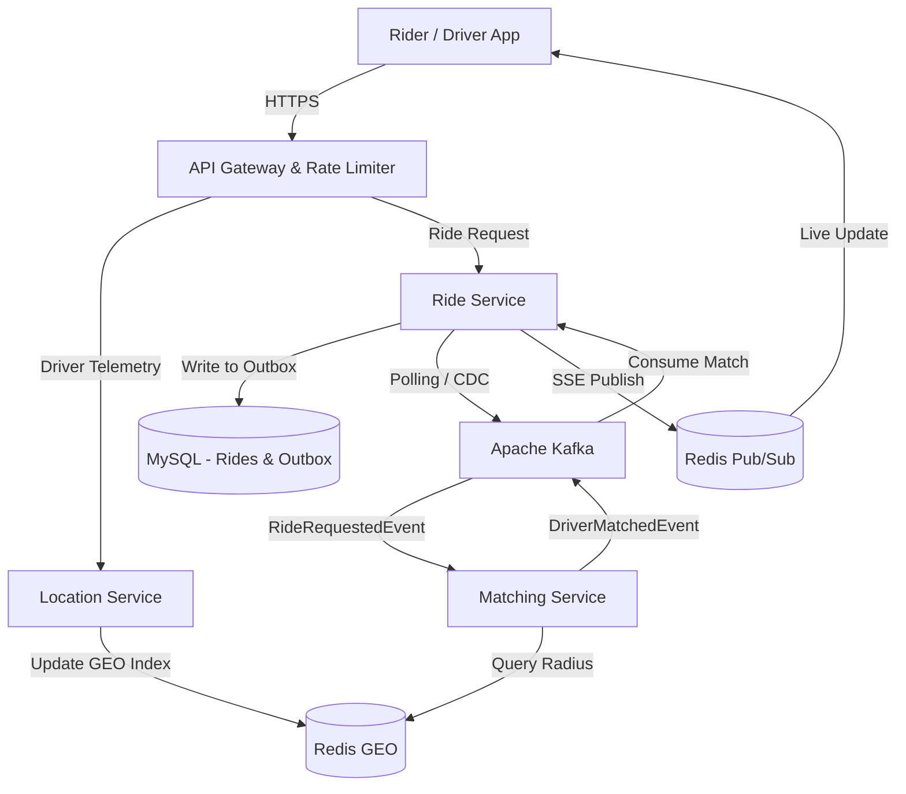

# Distributed Ride-Matching System


An enterprise-grade, event-driven microservices architecture simulating a high-scale ride-hailing backend (similar to Uber or Lyft). Designed to handle high-throughput telemetry ingestion and asynchronous matching coordination.

## 🏗️ System Architecture



## 🚀 Key Features

* **Event-Driven Choreography**: Utilizes Kafka and the Transactional Outbox Pattern to decouple ride requests from the heavy matching algorithms, ensuring the API never blocks or times out.
* **Real-time Spatial Indexing**: Drivers push telemetry to a Redis GEO index, allowing the system to perform O(log(N)) radius searches to instantly find nearby drivers.
* **Scalable Real-Time Updates**: Leverages Server-Sent Events (SSE) backed by a Redis Pub/Sub backplane, allowing the backend to scale horizontally while seamlessly pushing live UI updates to riders.
* **Resilience & Rate Limiting**: Built-in Circuit Breakers (Resilience4j) and dynamic rate limiting to protect services from DDOS attacks and sudden traffic spikes.

## 📦 Module Structure

* `api-gateway`: Spring Cloud Gateway handling routing, global rate-limiting, and security filtering.
* `common`: Shared DTOs, Kafka Event definitions, and Security Interceptors.
* `location-service`: Ingests high-frequency GPS telemetry and manages the Redis spatial grid.
* `ride-service`: Manages passenger ride state, billing, and pushes UI updates via SSE.
* `matching-service`: A Kafka-driven worker that executes the proximity/rating heuristic algorithm to pair riders with drivers.
* `frontend`: A React dashboard to simulate both Rider and Driver lifecycles.

## 🛠️ Local Development Setup

### 1. Infrastructure (Docker)
Ensure Docker is installed and running, then spin up the local infrastructure:
```bash
# Start Kafka & Redis (Assuming a docker-compose.yml exists)
docker-compose up -d

# Start Local MySQL
docker run --name distributed-ride-mysql -e MYSQL_ROOT_PASSWORD=root -e MYSQL_DATABASE=defaultdb -p 3306:3306 -d mysql:8.0

# Configure MySQL User for the applications
docker exec distributed-ride-mysql mysql -uroot -proot -e "CREATE USER 'avnadmin'@'%' IDENTIFIED BY 'password'; GRANT ALL PRIVILEGES ON *.* TO 'avnadmin'@'%'; FLUSH PRIVILEGES;"
```

### 2. Backend Services
Open the project in your IDE (IntelliJ / Eclipse) and ensure your `.env` file (if present) points to the local Docker database:
`DB_PASSWORD=password`

Boot the Spring Boot applications in the following order:
1. `ApiGatewayApplication`
2. `LocationServiceApplication`
3. `MatchingServiceApplication`
4. `RideServiceApplication` (Flyway will automatically run database migrations on boot)

### 3. Frontend Dashboard
```bash
cd frontend
npm install
npm run dev
```
